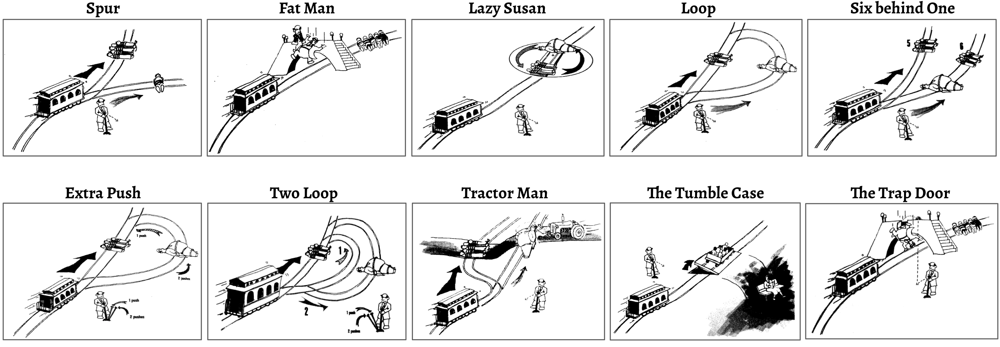
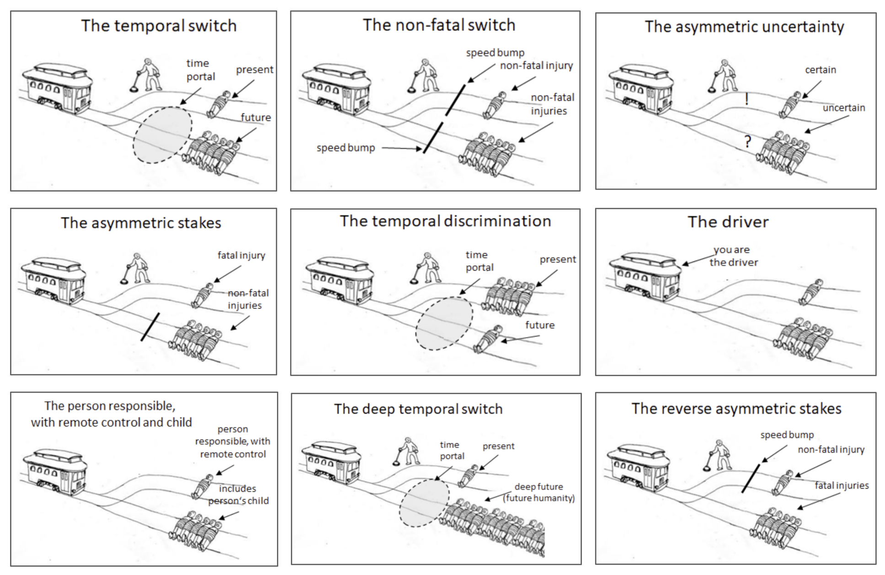
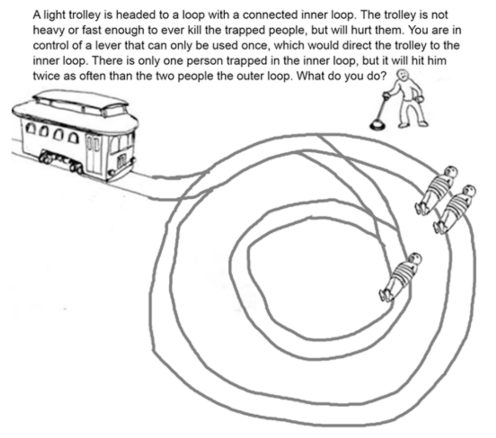
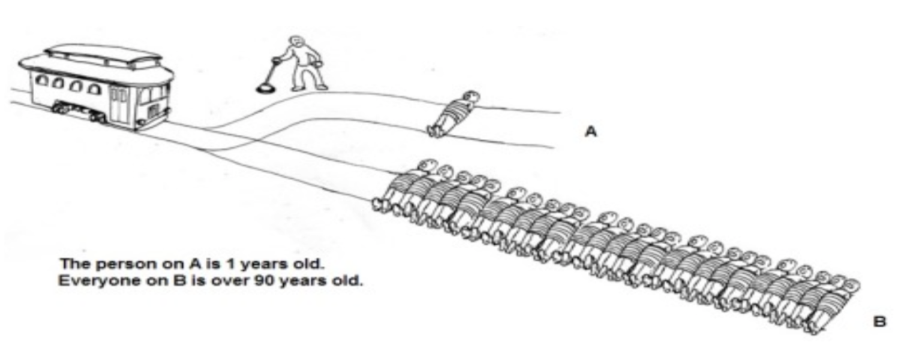
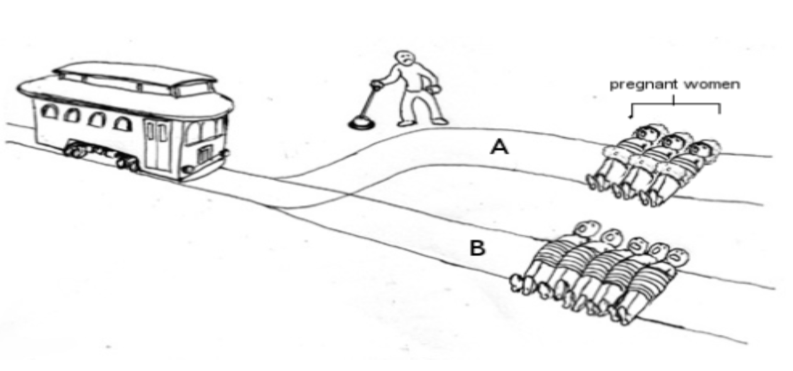
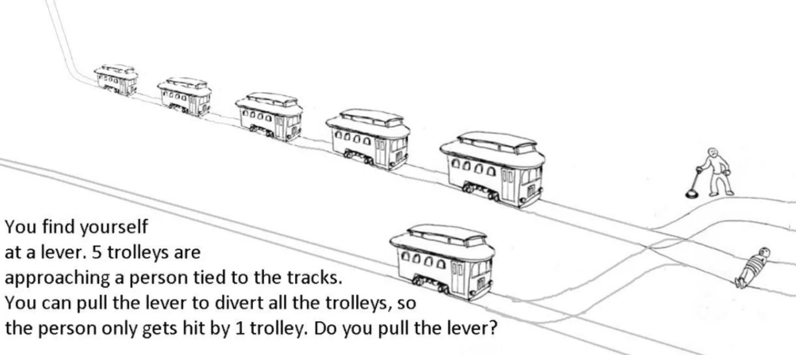
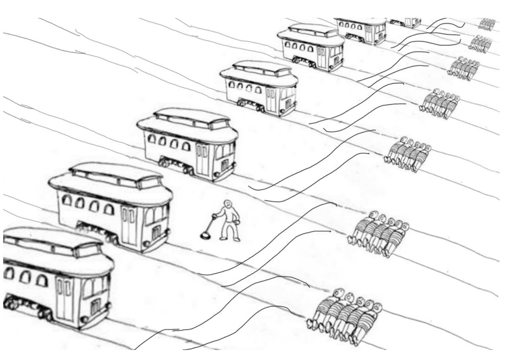
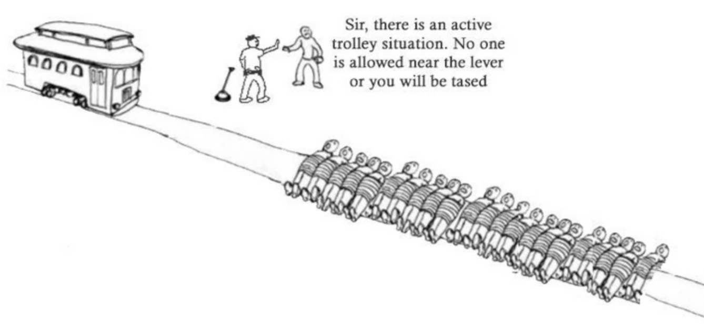
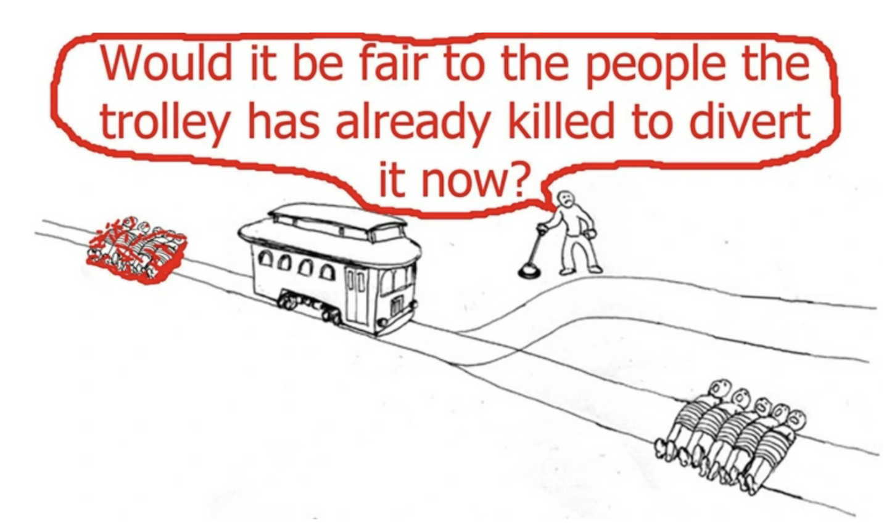
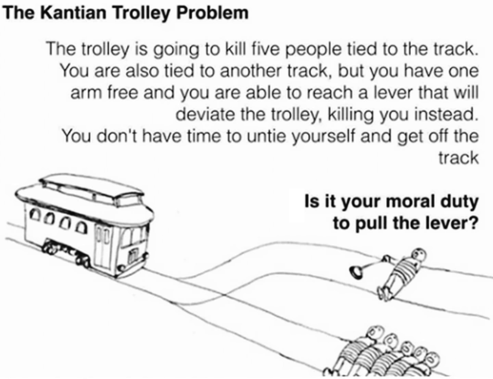

# Collected material on the Trolley Problem

Originally introduced by Philippa Foot in 1967 and later named and popularized by Judith Jarvis Thomson in 1976, the Trolley Problem is a thought experiment in ethics and moral psychology that explores whether it is morally permissible to sacrifice one person to save several others.
The classic scenario involves a runaway trolley heading toward five people on a track. A bystander or driver can pull a lever to divert the trolley onto another track, where it will kill one person instead.
The ethical dilemma highlights the tension between utilitarian reasoning (maximizing overall well-being) and deontological ethics (adherence to moral rules or duties). It also demonstrates how people's moral judgments can shift depending on small variations in the scenario.
The Trolley Problem and its many variations have become central to discussions in AI ethics, autonomous systems, and moral decision-making.

## Sources

* [`Wikipedia, The Free Encylopedia: Trolley problem`](https://en.wikipedia.org/wiki/Trolley_problem)
* [`Syed Ausaf Hasib, 01.09.2023: The Trolley Problem: A Moral Dilemma of Introspect unveiled`](https://www.ldsnitjsr.in/post/the-trolley-problem-a-moral-dilemma-of-introspect-unveiled)
* [`Richard Feenstra: Designing Ethics: Would You Throw the Fat Man Off the Bridge?`](https://www.decisionskills.com/the-trolley-problem.html)
* [`David Edmonds, 2014: Would You Kill the Fat Man?`](https://press.princeton.edu/books/hardcover/9780691154022/would-you-kill-the-fat-man?srsltid=AfmBOorrCc9idOXvlQOtzDtZlI9Ob5N8ZLJ1kwL7oqBPFZFVoE65nh8I)
* [`Dr. Iain Law, University of Birmingham, 2018: The Trolley Problem - Philosophy undergraduate lecture`](https://www.youtube.com/watch?v=0ghDWYNVjY8)
* [`Young-Jin Choi, 18.05.2021: 10 variations of the trolley problem to explain the difference between climate action and inaction`](https://www.linkedin.com/pulse/10-variations-trolley-problem-explain-difference-young-jin-choi-frsa/)
* [`E. Awad et al, 24.10.2018: The Moral Machine experiment, Nature?`](https://www.nature.com/articles/s41586-018-0637-6)
* [`Z. Jin et al, 2025: Language Model Alignment in Multilingual Trolley Problems`](https://arxiv.org/abs/2407.02273)
* [`Nolan Clarke, 03.12.2023: I Asked ChatGPT for Its Take on the Trolley Problem`](https://nolanclarke.medium.com/i-asked-chatgpt-for-its-take-on-the-trolley-problem-e3ebf1ff51fd)
* [`Bhargava Krishna Sreepathi, 21,07.2024: Solving the Trolley Problem with AI: LLMs to the Rescue!`](https://www.youtube.com/watch?v=lg2K0z4UBYM) At around 10:16 minutes in, 
Bhargava shows how ChatGPT 4o addresses the Trolley Problem and some of its variations.

## Variations

An incomplete list of variations of the Trolley Problem.

Image Source: [`David Edmonds, 2015: Würden SIE den dicken Mann töten?`](https://www.amazon.de/W%C3%BCrden-dicken-Mann-t%C3%B6ten-Trolley-Problem/dp/315011036X)

Image Source: [`Young-Jin Choi, 18.05.2021: 10 variations of the trolley problem to explain the difference between climate action and inaction`](https://www.linkedin.com/pulse/10-variations-trolley-problem-explain-difference-young-jin-choi-frsa/)

Image Source:

Image Source:

Image Source:

Image Source:

Image Source:

Image Source:

Image Source:

Image Source:

